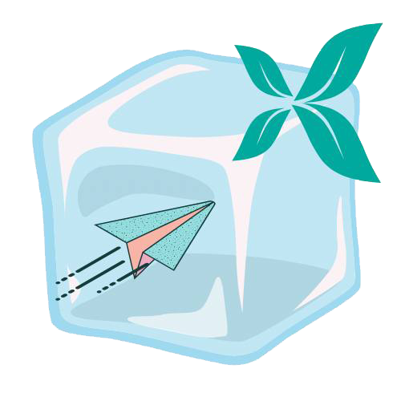
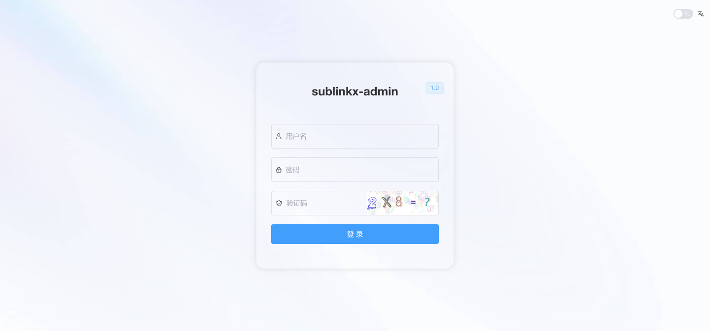
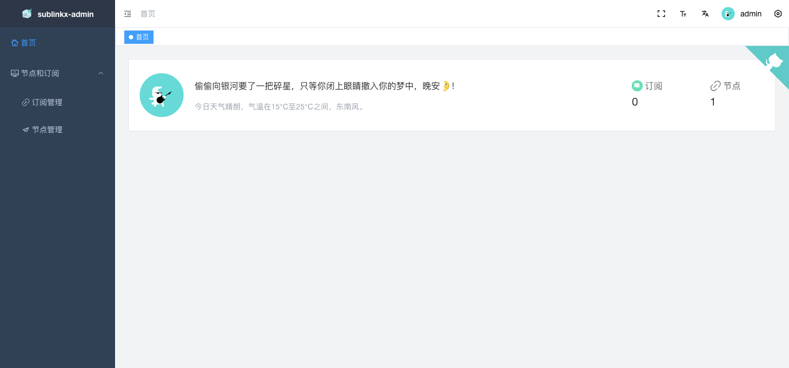

<div align="center">

</div>

<div align="center">
    
    
    
    
    <a href="https://t.me/+u6gLWF0yP5NiZWQ1" target="_blank">
    <div align="center"> 中文 | <a href="README.en-US.md">English</div>
        
</div>    

## [项目简介]

基于sublinkx作者原项目更新协议对接和完善：(https://github.com/gooaclok819/sublinkX)

前端基于：https://github.com/youlaitech/vue3-element-admin

后端采用go+gin+gorm

默认账号admin 密码123456  自行修改

## [项目特色]

目前仅支持客户端：v2ray clash surge

v2ray为base64通用格式

clash支持协议:ss ssr trojan vmess vless hy hy2 tuic

surge支持协议:ss trojan vmess hy2 tuic

## [项目预览]




## [2.1更新说明]

#### 后端更新

1. 修复底层代码
2. 修复各种奇葩bug
3. 建议卸载数据库(记得备份数据) 新数据库结构有些不一样可能会导致一些bug

#### 前端更新

1. 完善node页面


## [安装说明]
### 一键脚本部署方式：
```
bash <(curl -Ls https://raw.githubusercontent.com/vchan-ui/sublinkY/main/install.sh)
```

```sublink``` 呼出菜单

然后输入安装脚本即可

### docker方式：

在自己需要的位置创建一个目录比如mkdir sublinkx

然后cd进入这个目录，输入下面指令之后数据就挂载过来

需要备份的就是db和template
```
docker run --name sublinkx -p 8000:8000 \
-v $PWD/db:/app/db \
-v $PWD/template:/app/template \
-v $PWD/logs:/app/logs \
-d jaaksi/sublinkx
```

## Stargazers over time
[](https://starchart.cc/gooaclok819/sublinkX)

